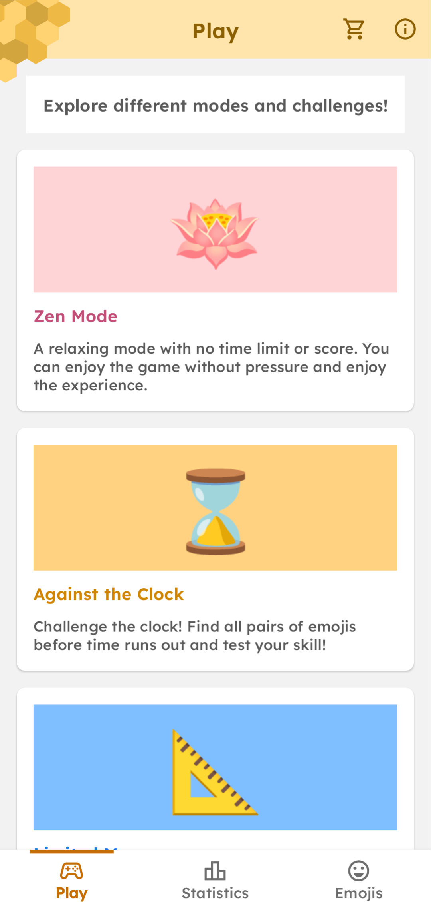
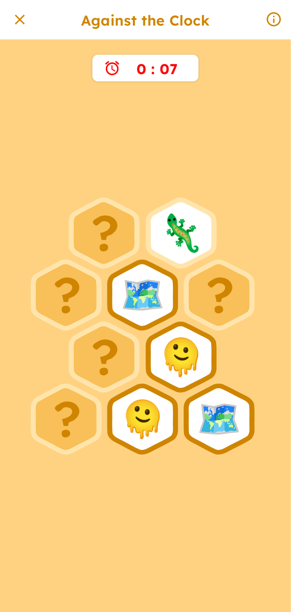
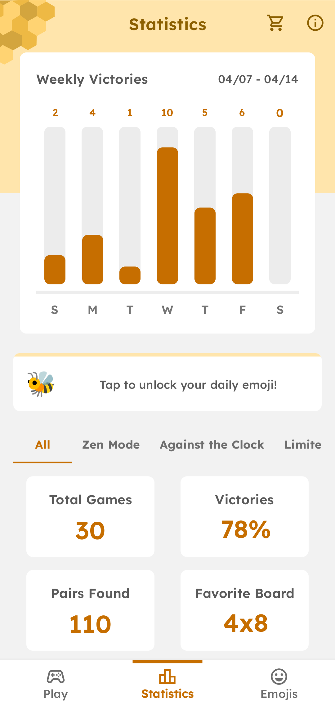
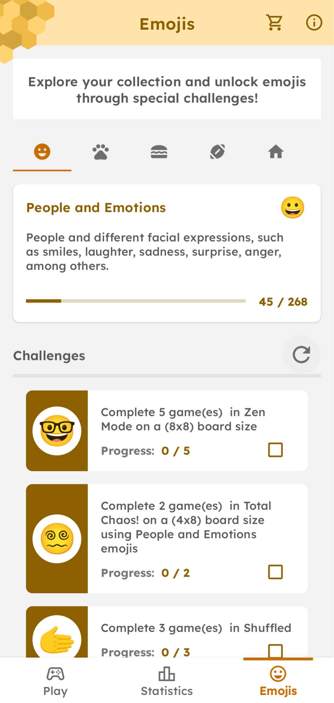

<h1 align="center">
    
</h1>

* [About](#-hexemoji)
* [Installation](#installation)
* [Showcase](#showcase)
* [Building](#building)
* [Tech Stack](#tech-stack)
* [Features](#features)
* [License](#license)


# 🐝 HexEmoji

HexEmoji is a small and simple memory game for Android. It features emoji-based puzzles with multiple game modes and over 1500 unique emojis to unlock through various challenges.

# Installation

Requirements:
* An Android device running Android 7.0 (Nougat, API 24) or higher.

You can install the app from the Google Play Store or download the APK from the GitHub releases page.

<h1 align="center">
    <a href="https://play.google.com/store/apps/details?id=ems.hexemoji&hl=en"></a>
    <a href="https://github.com/enzzoMs/HexEmoji/releases"></a>
</h1>

# Showcase

<h1 align="center">
    
    
    
    
</h1>

# Building

Requirements: 
* [Java](https://www.java.com/pt-BR/) 17 or higher.
* [Android SDK](https://developer.android.com/tools/sdkmanager): Android SDK tools and platform tools.

Clone this repository to your local environment or download the files:

```
git clone https://github.com/enzzoMs/HexEmoji.git
```

Navigate to the root directory of the project:

```
cd ./HexEmoji
```

Execute the following command to build the apk:

```
./gradlew assembleRelease
```

The resulting APK can be found in `app/build/outputs/apk/release/app-release-unsigned.apk`. You can then install the APK on a running emulator or a connected device.

Alternatively, you can open the project using [Android Studio](https://developer.android.com/studio?hl=pt-br), which offers a quick way to modify, compile, and run the application.

# Tech Stack

* [Kotlin](https://kotlinlang.org/) + [Coroutines](https://kotlinlang.org/docs/coroutines-overview.html)
* [MVVM Architecture](https://developer.android.com/topic/architecture#recommended-app-arch)
* [Room](https://developer.android.com/training/data-storage/room) + [SQLite](https://sqlite.org/)
* [Dependency Injection](https://developer.android.com/guide/navigation/use-graph/pass-data#Safe-args) + [Hilt-Dagger](https://developer.android.com/training/dependency-injection/hilt-android)
* [Navigation Component](https://developer.android.com/guide/navigation) + [Safe Args](https://developer.android.com/guide/navigation/use-graph/pass-data#Safe-args)
* [Live Data](https://developer.android.com/topic/libraries/architecture/livedata)
* [View Model](https://developer.android.com/topic/libraries/architecture/viewmodel)
* [View Binding](https://developer.android.com/topic/libraries/view-binding)

# Features 

* Multiple Game Modes: Enjoy different game modes including Zen, Against the Clock, Limited Moves, and more.
* Unlockable Emojis: Collect over 1500 emojis as you progress through the game.
* Challenges: Complete challenges to unlock emojis and advance in the game.
* Statistics: Track your progress with weekly statistics.

# License

This project is distributed under the MIT License. Check the [LICENSE](https://github.com/enzzoMs/HexEmoji/blob/main/LICENSE) file for more details.
